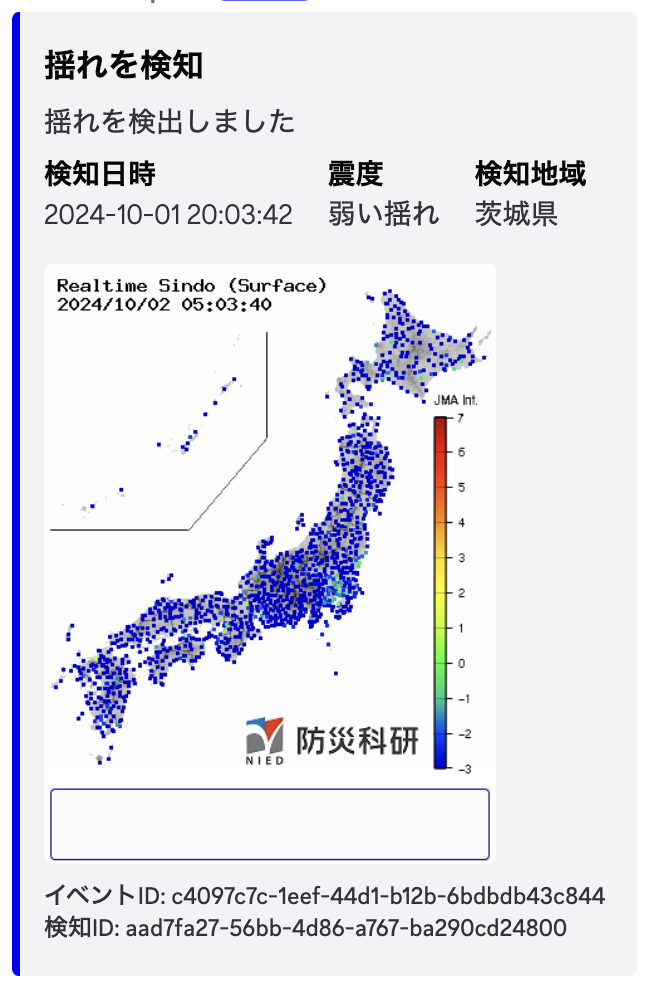

# Kyoshin Report BOT

<div style="text-align: center;">
    
</div>
※現在のものではありません

> [!CAUTION]
> 私は利用規約の怪文書を理解できないので利用規約に違反している可能性があります。
> もし違反しているようでしたらIssuesなどで優しく注意して上げてください...

## 環境構築 JavaScript編

> [!WARNING]
> nodejs がインストールされている前提です。

### クローン

GitHub からリポジトリをクローンします。

```bash
git clone https://github.com/nikkou-0814/Kyoshin-Report-BOT.git
```

### 環境変数

1. .env をコピーしJavaScriptフォルダへ移動

```bash
cp .env.example .env
```

Discord BOT のトークン、チャンネルID、ポート記載します。

2. TOKEN=<DISOCRD_TOKEN>

3. ChannelID=<DISCORD_ChannelID>

4. PORT=<SERVER_PORT>

### 依存関係のインストールと起動

```bash
cd JavaScript

npm install

npm start
```

## 環境構築 Python編
> [!CAUTION]
> Pythonは開発の終了をしました。
>　今後更新はされませんので注意してください

> [!WARNING]
> python3 がインストールされている前提です。

### クローン

GitHub からリポジトリをクローンします。

```bash
git clone https://github.com/nikkou-0814/Kyoshin-Report-BOT.git
```

### 環境変数

1. .env をコピーしPythonフォルダへ移動

```bash
cp .env.example .env
```

Discord BOT のトークンとチャンネルIDを記載します。

2. TOKEN=<DISOCRD_TOKEN>

3. ChannelID=<DISCORD_ChannelID>

### 依存関係のインストールと起動

```bash
pip install -r requirements.txt

python app.py
```

## KyoshinEewViewer for ingenをインストール

### <a href="https://github.com/ingen084/KyoshinEewViewerIngen">こちらからダウンロード</a>

### ワークフローの設定

設定 → ワークフロー → 新規追加 →

トリガー → ```(強振モニタ)揺れ検知```

アクション → ```指定したURLに内容をPOST```

URL → ```http://localhost:8000/endpoint```※ローカルの場合

※バージョンによって違う可能性があります

## 貢献について

貢献は歓迎しています！少し修正してプルリクエストをしていただけるだけでも光栄です！

## 謝辞

### KyoshinEewViewer for ingen (ingen様)
### 強振モニタ (防災科学技術研究所様)
